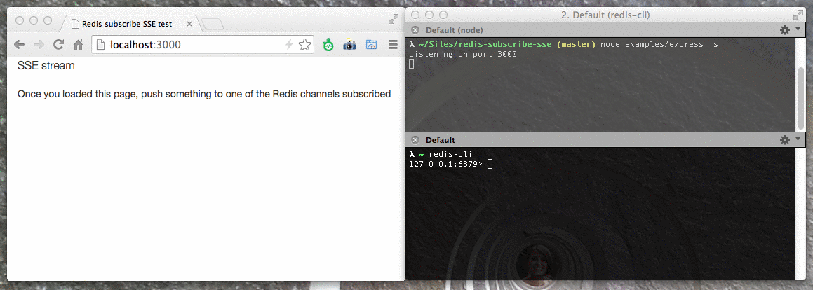

redis-subscribe-sse
==================

#### (from) Redis subscribe (to) HTML5 Server-Sent Events

<p align="center">
  
</p>

A [Readable Stream](http://nodejs.org/api/stream.html#stream_class_stream_readable) that transforms messages received over a [Redis PUBSUB channel](http://redis.io/topics/pubsub) to valid [HTML5 Server-Sent Events](http://www.w3schools.com/html/html5_serversentevents.asp).

Features:

* Can listen to one or more Redis PUBSUB channels
* Can associate Redis `channel` name to SSE `event` property, so publish on `test` channel means listening to `test` event on client-side
* Supports both `subscribe` and `psubscribe` modes

We also provide examples (backend and frontend) with:
  * [Koa](http://koajs.com) - [Example]()
  * [Express](http://expressjs.com) - [Example]()
  * Plain node [http](http://nodejs.org/api/http.html) server - [Example]()
  * CORS (EventSource on a different host/port) - [Example]()


## Install

With [npm](http://npmjs.org/):

```
npm install redis-subscribe-sse
```

## Use cases

A typical use case is when you want to notify the end of an *async* task to a client, and you use Redis PUBSUB as a messaging service (which very fast and reliable). Example: a background worker has terminated its work, sends a message over Redis PUBSUB, and you want to forward that on the client side in order to show a notification.


## How to use

To obtain a `redis-subscribe-stream` instance, you have to do:

```javascript

var subscribe = require('redis-subscribe-sse');
var stream = subscribe({ /* options */ });

```

stream available `options` are:

- `channels` (Array, required): list of Redis channels to subscribe.
- `streamOptions`: (Object, optional): options passed to underlying Readable stream. Default: `{}`.
- `host` (String, optional): Redis host. Default: `127.0.0.1`
- `port` (Number, optional): Redis port. Default: `6379`
- `password` (String, optional): Redis password (if you need `AUTH`)
- `clientOptions`: [node_redis](https://github.com/mranney/node_redis) client options
- `retry` (Number, optional): SSE *retry* property. Usually a client tries to reconnect after 3-4 seconds after losing SSE connection. If you want to change that interval, you can set this property (in **ms**). Default: `5000`.
- `channelsAsEvents`: (Boolean, optional): Associate Redis channel names to SSE *event* property. This way, on client side you can listen to names events instead of generic messages. See `examples/koa.js` for a detailed example. Default: `false`.
- `patternSubscribe`: (Boolean, optional): Use Redis [PSUBSCRIBE](http://redis.io/commands/psubscribe) instead of SUBSCRIBE. Default: `false`.
- `transform`: (Function, optional): It can be used for doing some message manipulation before pushing it to the stream. Signature is `(message, *callback)` and **it must returns a string** (See below).


## Message manipulation

The `transform` option is a function with this signature: `(message, callback)`. The callback is _optional_ and if passed it will allow to perform some _async_ message manipulation. Otherwise, it will do a _sync_ message manipulation.

It could be useful if you need to do e.g. encoding/decoding operations before pushing message to the client.

Some examples:

#### Async message manipulation

In this mode, you have to pass a callback function as the second argument to `transform`:

```javascript
let s = subscribe({
  channels: 'transform-test',
  transform: (msg, callback) => {
    setTimeout(() => {
      callback(`${msg} world`)
    }, 100)
  }
})
```

#### Sync message manipulation

In this mode, simply return the manipulated message from `transform` function:

```javascript
let s = subscribe({
  channels: 'transform-test',
  transform: (msg) => {
    return `${msg} world`
  }
})
```


## Tests

```
npm test
```


## Debug

This module is built with [debug](https://github.com/visionmedia/debug). If you want to see debug messages:

```
$ DEBUG=redis-subscribe-sse node ./examples/express
```


## Examples

### Server side

See `/examples` folder. You'll find examples using [redis-subscribe-sse](https://github.com/mpangrazzi/redis-subscribe-sse) with:

  * [Koa](http://koajs.com) - [Example]()
  * [Express](http://expressjs.com) - [Example]()
  * Plain node [http](http://nodejs.org/api/http.html) server - [Example]()
  * CORS (EventSource on a different host/port) - [Example]()

```
$ node ./examples/express
$ node ./examples/koa
```

### Client side

On client side, you can listen to SSE events using EventSource API (or a polyfill):

```javascript

  // NOTE: If you want full cross-browser support,
  //       you may have to use a polyfill

  var source = new EventSource('/stream');

  source.onopen = function() {
    console.log('Connected');
  });

  // if you set `channelsAsEvents: true`:

  source.addEventListener('test-express', function(e) {
    console.log(e.type) // => Redis channel name
    console.log(e.data) // => message
    
    // Here you can show a notification or else
    
  }, false);

  // otherwise:

  source.onmessage = function(e) {
    console.log(e.data); // => message
    
    // Here you can show a notification or else
    
  });

```


